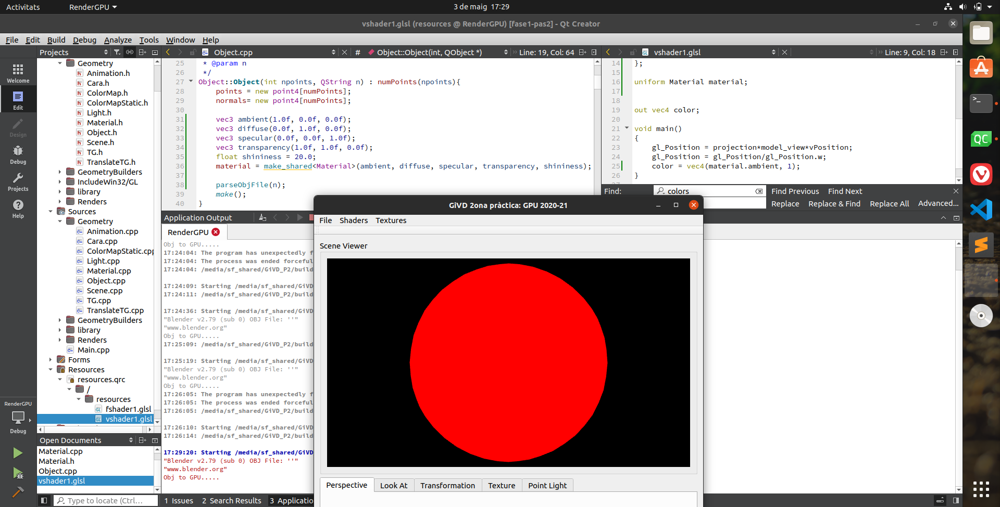
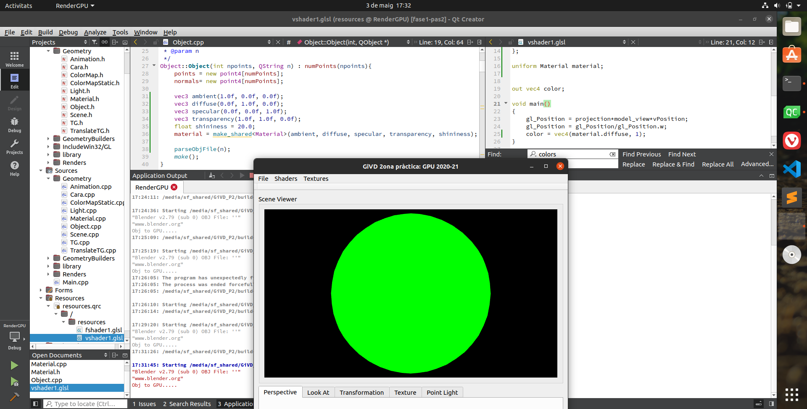
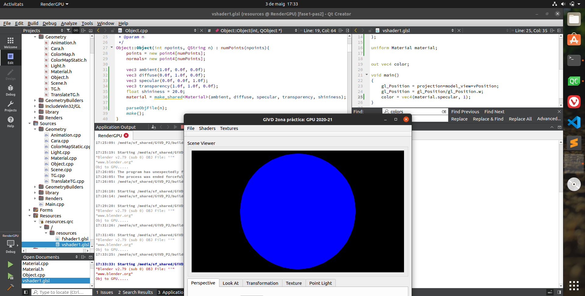
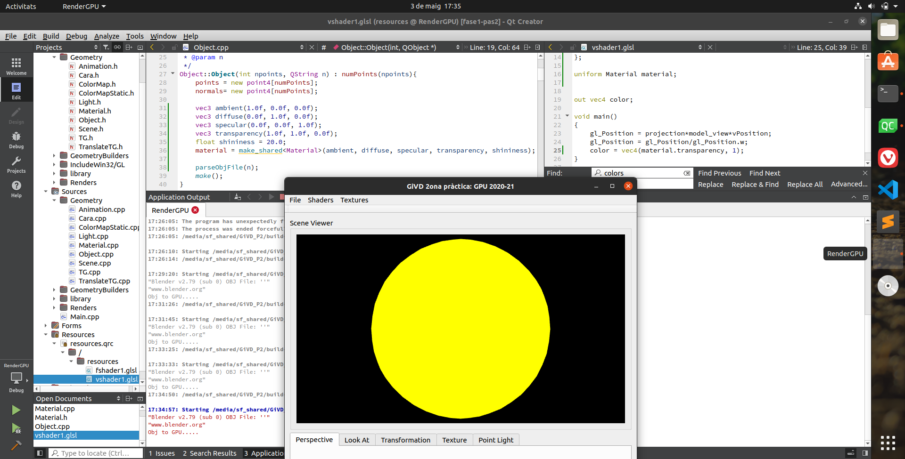
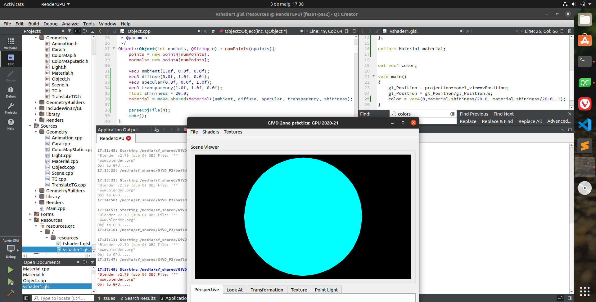
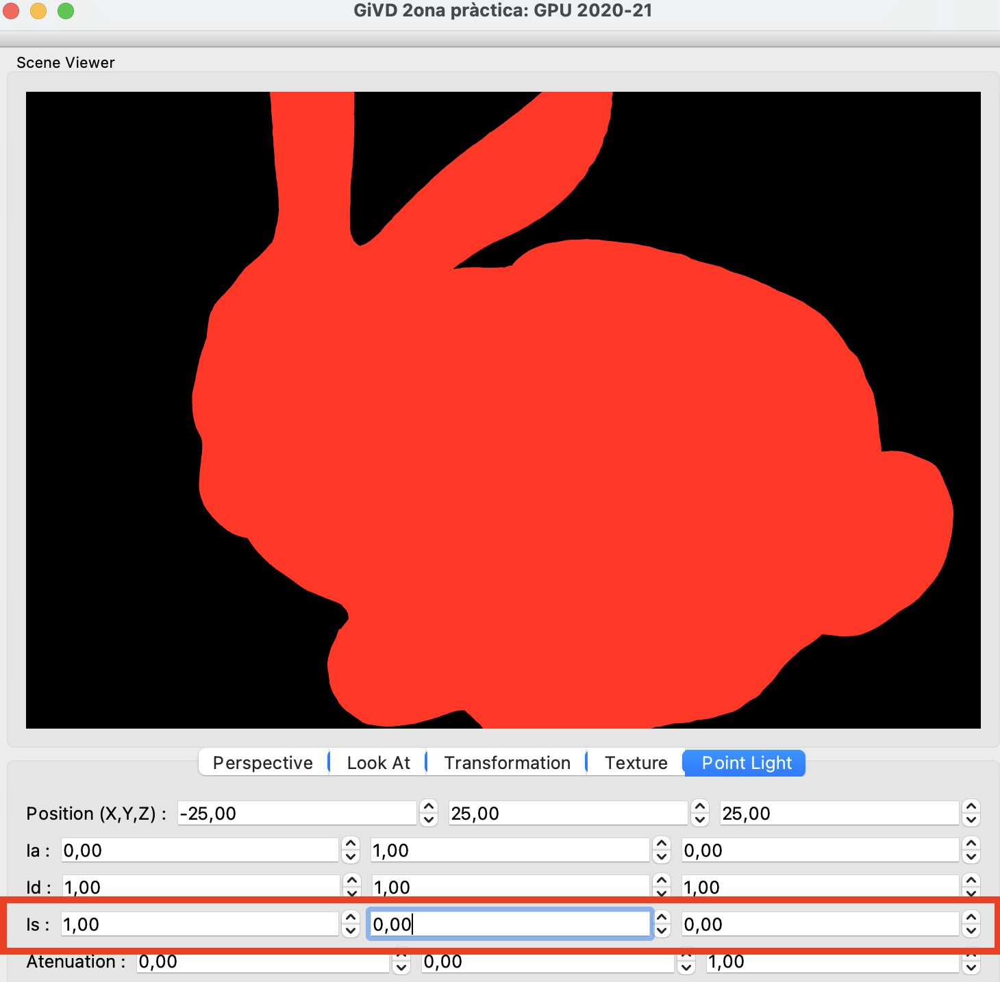
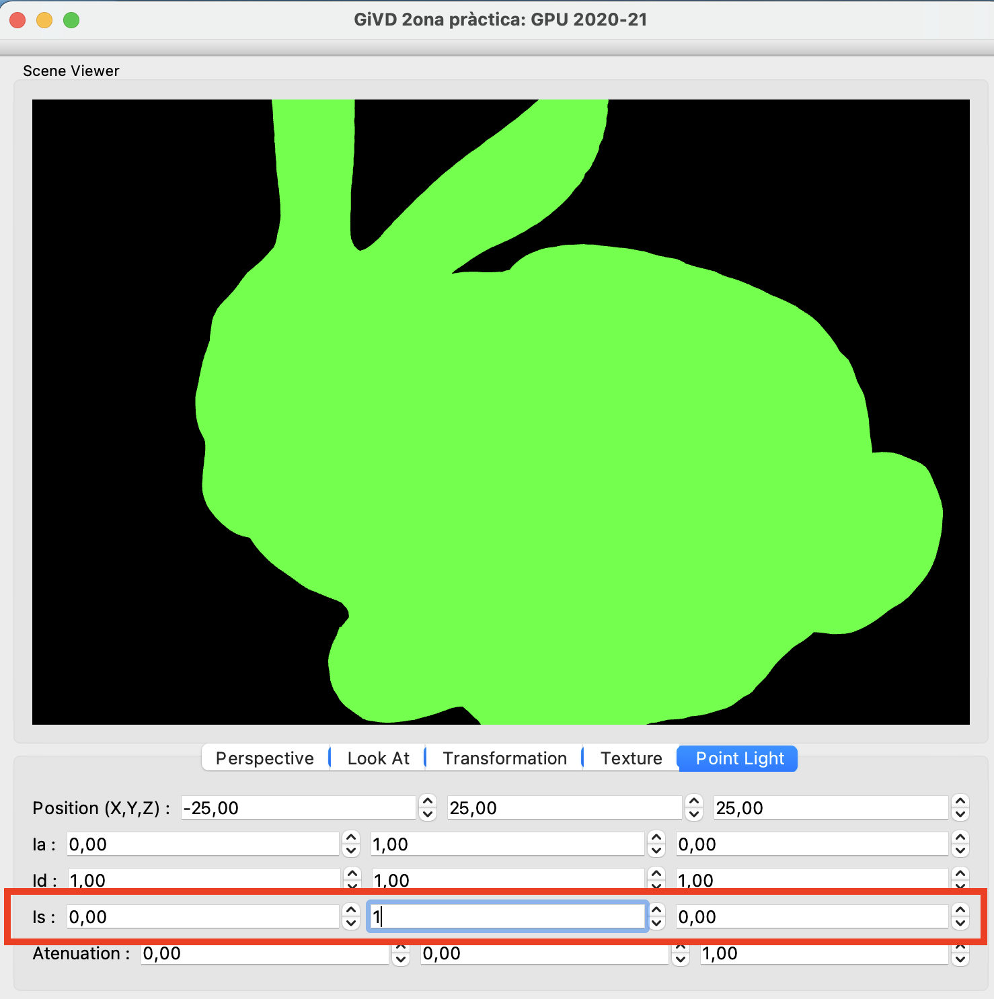
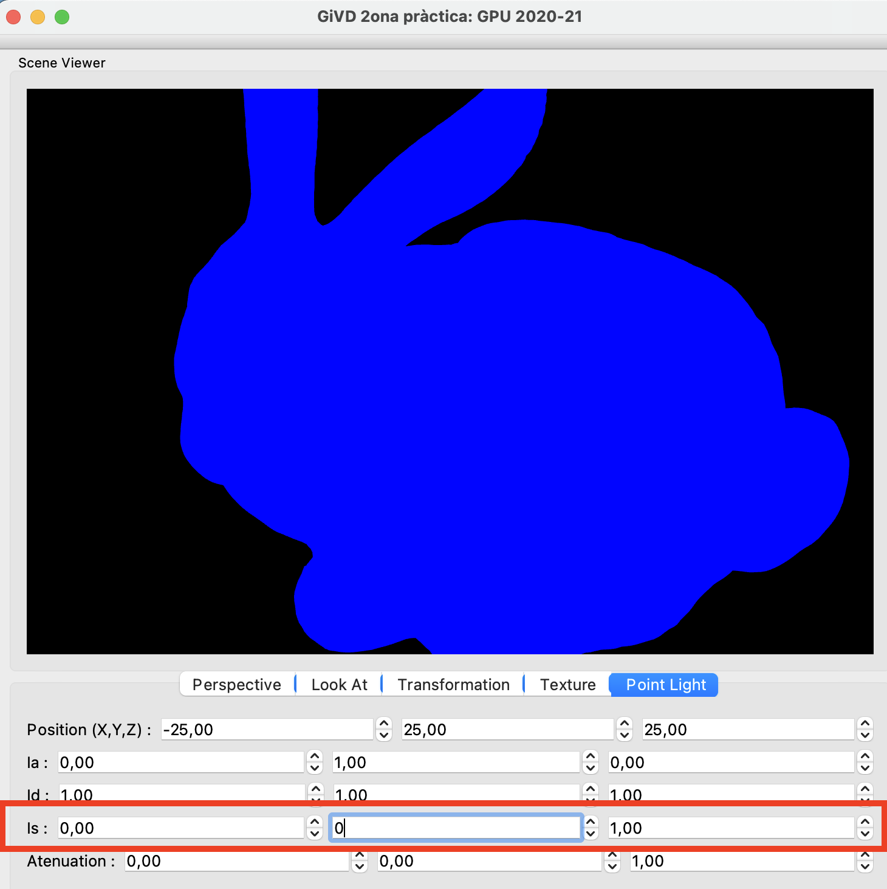

# RenderGPU
Segona pràctica de GiVD 2020-21
    
**Abstract**

*(NOTA: Petit resum del què heu fet, no més de 200 paraules)*

**Features**

*(NOTA: Quines parts heu desenvolupat i qui ho ha fet de l'equip. Editeu la llista que teniu a continuació afegint darrera de cada punt, la/es persona/es que ha treballat en aquell punt.)*

- Fase 1
    - Adaptació a la lectura de fitxers de dades: *Carla, Albert*
        - [X] Objectes
        - [X] Escenes virtuals
        - [X] Escenes de dades Reals 
        - [X] [OPT] Implementació càrrega paleta
    - Material: *Martí*
        - [X] Implementar classe Material
        - [ ] [OPT] Llegir material .mtl
    - Light: *Arnau*
        - [X] Puntual
        - [X] Direccional (Interfície: Albert)
        - [X] [OPT] Spotlight
        - [X] Ambient Global
    - Shading: Albert, Arnau
        - [X] Phong
        - [X] Gouraud
    - Textures
        - [ ] Textura com material en un objecte
        - [ ] Textura al pla base
        

- Fase 2 (OPT)
    - [X] Toon-shading *Albert*
    - [ ] Èmfasi de siluetes
    - [ ] Mapping indirecte de textures
    - [ ] Animacions amb dades temporals
    - [ ] Normal mapping
    - [ ] Entorn amb textures
    - [ ] Reflexions
    - [ ] Transparencias via objectes.
    - [ ] Transparencias via environmental mapping.

## Extensions

*(NOTA: Les extensions de la pràctica que heu fet i que no surten a la llista anterior)*

## Memòria

*(NOTA: Explicació només dels diferents punts que heu desenvolupat i funcionen, detallant les estratègies que heu fet servir)*

### Pas 1

### Pas 2

Per a comprovar que el pas de les característiques del material de la CPU a la GPU funciona hem dut a terme les següents comprovacions:

- A cada atribut del material li hem assignat un valor força reconeixible, en el nostre cas, ambient = vermell, difus = verd, especular = blau, transparència = groc, i hem fixat shininess = 20.0.
- Després hem fet cinc proves diferents, modificant el fitxer del vertex shader. En les quatre primeres hem assignat la component ambient, difusa, especular i de transparència com a color de l'objecte, i hem obtingut les pantalles següents:

`ambient = (1, 0, 0)`        |  `diffuse = (0, 1, 0)`  
:-------------------------:|:-------------------------:
  |  

`specular = (0, 0, 1)`        |  `transparency = (1, 1, 0)`  
:-------------------------:|:-------------------------:
  |  

- Per a veure que el float de shininess també es rebia bé a la GPU hem fet que el color de l'objecte vingués donat pel color `color = vec4(0,material.shininess/20.0, material.shininess/20.0, 1);`, és a dir, (0,1,1), i per tant hauriem de veure el color cyan:

`shininess = 20.0`
:-------------------------:

- Finalment podem concloure que la informació del material es passa correctament a la GPU.

### Pas 3

Hem implementat l'enviament d'informació a la GPU pel cas de les llums, als mètodes `lightsToGpu` i `setAmbientToGPU` seguint els passos del guió.

Al igual que al cas anterior, hem realitzat comprovacions passant atributs arbitraris de les llums a la GPU i visualitzant-los directament com a colors. En aquest cas, hem utilitzat la interfície gràfica on podem fàcilment modificar valors per les comprovacions necessàries. En les imatges que es mostren a configuració, estem utilitzant `color = vec4(lights[0].specular,1)` com a color de sortida del vertex shader.

`specular = (1, 0, 0)`        |  `specular = (0, 1, 0)`   |  `specular = (0, 0, 1)`  
:-------------------------:|:-------------------------:|:-------------------------:
  |   |  

Hem realitzat també proves amb els altres atributs, tot i que només estem mostrant la component especular en aquesta memòria. Per tant, concloure també que la informació de les llums es passa correctament a la GPU.

### Pas 4

### Pas 5

## Screenshots

*(NOTA: Per a cada pas de l'enunciat (del 1 al 6), incloure captures de pantalla de les proves que heu fet per a demostrar la funcionalitat de la vostra pràctica amb explicacions de la seva configuració i com les heu aconseguides)*

*(NOTA2: Breu explicació, si cal, de com replicar els vostres resultats)*

## Additional Information

*(NOTA: Hores de dedicació i problemes que heu tingut fent la pràctica)*
