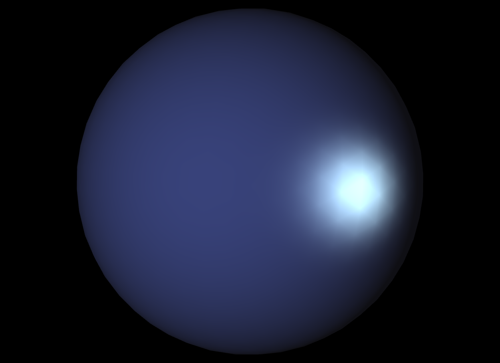
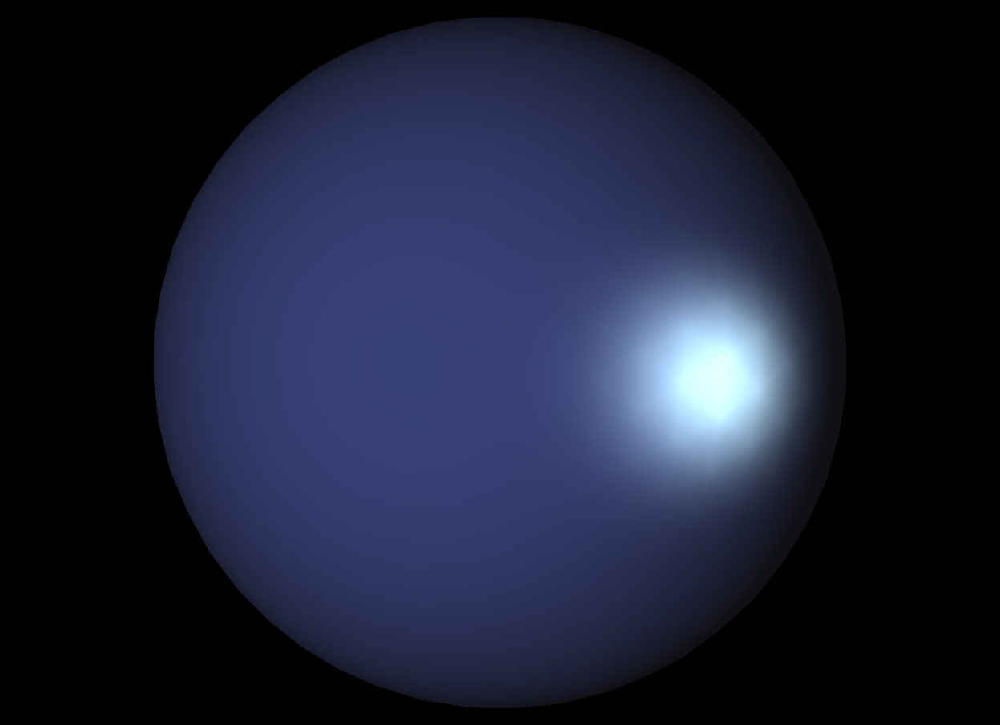
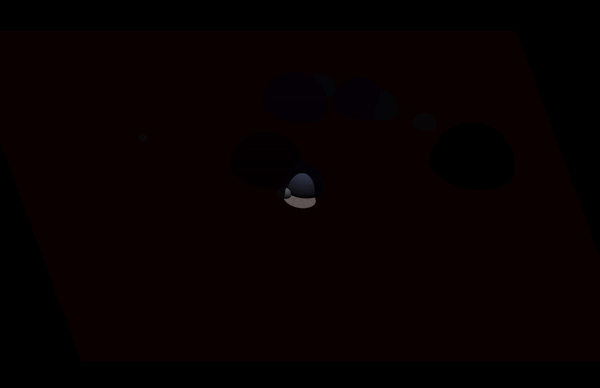

# RenderGPU
Segona pràctica de GiVD 2020-21
    
**Abstract**

*(NOTA: Petit resum del què heu fet, no més de 200 paraules)*

**Features**

*(NOTA: Quines parts heu desenvolupat i qui ho ha fet de l'equip. Editeu la llista que teniu a continuació afegint darrera de cada punt, la/es persona/es que ha treballat en aquell punt.)*

- Fase 1
    - Adaptació a la lectura de fitxers de dades: *Carla, Albert*
        - [X] Objectes
        - [X] Escenes virtuals
        - [X] Escenes de dades Reals 
    - Material: *Martí*
        - [X] Implementar classe Material
    - Light: *Arnau* (*Interfície gràfica: Albert*)
        - [X] Puntual
        - [X] Direccional 
        - [X] [OPT] Spotlight
        - [X] Ambient Global
    - Shading: *Albert, Arnau*
        - [X] Phong
        - [X] Gouraud
    - Textures: *Carla, Martí*
        - [X] Textura com material en un objecte
        - [X] Textura al pla base

        

- Fase 2 (OPT)
    - [X] Toon-shading: *Albert*
    - [X] Diversos objectes poden tenir diferents materials/textures *Albert*
    - [X] Implementació càrrega paleta (.gpl) *Albert*
    - [X] Llegir material .mtl *Albert*
    - [ ] Èmfasi de siluetes
    - [X] Mapping indirecte de textures: *Carla, Martí*
    - [ ] Animacions amb dades temporals
    - [ ] Normal mapping
    - [ ] Entorn amb textures
    - [ ] Reflexions
    - [ ] Transparencias via objectes.
    - [ ] Transparencias via environmental mapping.
    - [X] Mandelbrot shader *Albert*

## Extensions

*(NOTA: Les extensions de la pràctica que heu fet i que no surten a la llista anterior)*

## Memòria

*(NOTA: Explicació només dels diferents punts que heu desenvolupat i funcionen, detallant les estratègies que heu fet servir)*

### Pas 1
Aquest pas es tractava de reutilitzar el codi de la pràctica 1 per poder llegir els escenes de ```VirtualWorld``` o ```RealWorld```. Hem reutilitzat les classes ```Mapping```, ```ConfigMappingReader```, ```VirtualWorldReader```, ```RealDataReader```, i hem utilitzat el ```Builder``` com a classe que s'encarrega d'instanciar-les, segons les calls que ens arriben des de ```MainWindow```.
Algunes variacions respecte el codi de la primera pràctica són que, en aquesta pràctica, tots els objectes son del mateix tipus, BoundaryObjects (formats per malles de triangles), per la naturalesa dels mètodes projectius. En les nostres escenes virtuals, a més, permetem indicar la posició de l'objecte i la escala. Per tal de posicionar l'objecte a la posició desitjada i escalar-lo, primer obtenim la capsa mínima i el centre d'aquesta capsa, després movem tots els vertexs segons la distància entre l'origen i el centre de la capsa, per tal de centrar l'objecte. Després, aprofitem i fem l'escalat (multipliquem tots els vèrtex). Un cop fet, seguirà estant centrat, així que simplement traslladem tots els vèrtexs a la posició desitjada. 

Aquí tenim un exemple, on tots els objectes son ```sphere0.obj```, que hem modificat en la nostra escena per tenir posicions i mides diferents (veure ```VW_ScenePas1.txt```):


**TODO: EXPLICAR FITTED PLANE (CARLA)**

En la següent imatge, es pot veure com les dades del món real es carreguen correctament (```RW_Scene1.txt```):


### Pas 2

Per a comprovar que el pas de les característiques del material de la CPU a la GPU funciona hem dut a terme les següents comprovacions:

- A cada atribut del material li hem assignat un valor força reconeixible, en el nostre cas, ambient = vermell, difus = verd, especular = blau, transparència = groc, i hem fixat shininess = 20.0.
- Després hem fet cinc proves diferents, modificant el fitxer del vertex shader. En les quatre primeres hem assignat la component ambient, difusa, especular i de transparència com a color de l'objecte, i hem obtingut les pantalles següents:

`ambient = (1, 0, 0)`        |  `diffuse = (0, 1, 0)`  
:-------------------------:|:-------------------------:
  |  

`specular = (0, 0, 1)`        |  `transparency = (1, 1, 0)`  
:-------------------------:|:-------------------------:
  |  

- Per a veure que el float de shininess també es rebia bé a la GPU hem fet que el color de l'objecte vingués donat pel color `color = vec4(0,material.shininess/20.0, material.shininess/20.0, 1);`, és a dir, (0,1,1), i per tant hauriem de veure el color cyan:

`shininess = 20.0`
:-------------------------:


- Finalment podem concloure que la informació del material es passa correctament a la GPU.

### Pas 3

Hem implementat l'enviament d'informació a la GPU pel cas de les llums, als mètodes `lightsToGpu` i `setAmbientToGPU` seguint els passos del guió.

Al igual que al cas anterior, hem realitzat comprovacions passant atributs arbitraris de les llums a la GPU i visualitzant-los directament com a colors. En aquest cas, hem utilitzat la interfície gràfica on podem fàcilment modificar valors per les comprovacions necessàries. En les imatges que es mostren a configuració, estem utilitzant `color = vec4(lights[0].specular,1)` com a color de sortida del vertex shader.

`specular = (1, 0, 0)`        |  `specular = (0, 1, 0)`   |  `specular = (0, 0, 1)`  
:-------------------------:|:-------------------------:|:-------------------------:
  |   |  

Hem realitzat també proves amb els altres atributs, tot i que només estem mostrant la component especular en aquesta memòria. Per tant, concloure també que la informació de les llums es passa correctament a la GPU.

Al pas 4 mostrarem les diferents llums implementades als shaders.

### Pas 4

El pas 4 d'aquesta pràctica consistia en implementar shaders de Gouraud i Phong a la GPU. Els dos són similars, ja que per tots dos utilitzarem el mètode de Blinn-Phong pel càlcul del color. La diferència entre els dos és que a Gouraud Blinn-Phong es calcula al vertex shader i s'interpola (suavitza) el color en rasteritzar, mentre que en el cas de Phong, al vertex shader retorna la normal i és aquesta la que s'interpola (suavitza) per després calcular a cada pixel el color amb Blinn-Phong, utilitzant aquesta normal suavitzada.

El procediment per implementar Gouraud i Phong, per tant, ha estat molt similar. Ens hem basat en el codi de Blinn-Phong que vam fer a la pràctica 1 de Raytracing, amb les adaptacions necessàries. A continuació mostrem l'escena de test proposada amb els paràmetres indicats.

`Gouraud`        |  `Phong`  
:-------------------------:|:-------------------------:
  |  

Es pot apreciar lleugerament la diferència, sobretot en la part més il·luminada, on Phong aconsegueix un efecte més suavitzat que Gouraud.

També hem provat amb diferents tipus de llum: PointLight i DirectionalLight. Hem inclòs una opció per escollir entre PointLight i DirectionalLight directament des de interfície gràfica per poder realitzar fàcilment aquestes visualitzacions. 

`PointLight pos=(-1,0,0)`        |  `DirectionalLight dir=(1,0,0)`    |  `PointLight pos=(-100,0,0)`   
:-------------------------:|:-------------------------:|:-------------------------:
  |   |  

Com podem veure a les imatges, la segona i la tercera són pràcticament idèntiques, com era d'esperar, ja que posant una pointlight a la posició (-100,0,0) sense atenuació estem simulant una llum direccional, ja que els rajos de llum venen gairebé paral·lels, ja que esta a una posició molt allunyada (passa com la llum del sol, que a efectes pràctics la podem considerar direccional). En canvi, la primera imatge és una PointLight en la posició (-1,0,0), molt propera a la esfera, i tot i ser similar a les altres, es veu clarament l'efecte punt de llum.

#### OPT: Spotlight

Per implementar el spotlight hem seguit les indicacions del recurs proporcionat (http://math.hws.edu/graphicsbook/c7/s2.html). 

A part dels atributs direcció i angle que es proposaven al guió, hem implementat un atribut *sharpness*, que al link anterior anomenen *spot exponent*, que regula com de suau es la frontera de la llum. Tant per l'angle com per la sharpness hem afegit sliders a la per tal que sigui més fàcil jugar amb la spotlight des de la interfície gràfica.

A continuació mostrem tres exemples d'una Spotlight apuntant cap a una esfera, amb diferents configuracions d'angle i sharpness. Al tercer exemple, que és una spotlight amb angle gran, on la "frontera" del con de llum no es veu a la esfera, obtenim exactamente el mateix efecte que amb una PointLight.

`SpotLight angle petit, sharpness alta`        |  `SpotLight angle petit, sharpness baixa`    |  `SpotLight angle gran`   
:-------------------------:|:-------------------------:|:-------------------------:
  |   |  

*Nota: Una Spotlight conceptualment hauria de tenir una posició, ja que s'ha de tenir una posició des de la qual es projecta el con de llum. Per simplificar la implementació, només li posem una direcció, i la posició serà -direcció. És a dir, si posem spotlight amb direcció (1,0,0), projectarem el con de llum des de (-1,0,0). Si volguessim el con més lluny, hauríem d'ajustar el mòdul del vector direcció que escollim. És com si projectessim des d'una esfera de radi = |direcció| apuntant cap a l'origen de coordenades.*


### Pas 5

Hem implementat la lectura de textures per aquells objectes que tenen coordenades de textura. Per a fer-ho, hem creat dos atributs a la classe Object.cpp que indiquen si un objecte pot tenir textura (`canHaveTexture`) i si realment té textura (`hasTexture`). Hem implementat les textures tant a gouraud com a phong i a toon shading. En el cas de gouraud hem provat d'implementar el color de textura directament al vertex, com a component difusa, però després en extrapolar el color final al fragment queda poc detallat. Després hem provat de posar un 75% del color final segons la textura al fragment, i el 25% restant corresponent al color rebut de gouraud (on la component difosa també és la textura). Finalment, hem implementat la textura en phong, on fem que el color de la textura sigui la component difosa. A continuació es poden veure les diferències en un cas particular.

Gouraud textura vertex        |  Gouraud textura a fragment 75%  |  Phong
:-------------------------:|:-------------------------:|:-------------------------:
  |   |  


## Opcionals
### Toon Shading
El toon shading consisteix en fer que els objectes tinguin un estil que s'assembli al d'un còmic. La implementació realitzada varia una mica respecte la proposada a l'enunciat. En el nostre cas, un cop tenim el producte escalar entre la normal i el vector de la llum, separem aquest resultat en esglaons (0-0.25 -> 0, 0.25-0.5 -> 0.25, 0.5-0.75 -> 0.5, 0.75-1 -> 0.75). Després, transformem el color que ens dona la component difosa del material de l'objecte, de rgb a hsv. En hsv, multipliquem el valor de v pel factor obtingut anteriorment, i transformem de nou a rgb. hsv ens permet que aquests transformació sigui lineal, al contrari de rgb. Aquí tenim un parell d'exemples on es pot veure els resultats: 

`sphere0.obj`        |  `cruiser.obj`  
:-------------------------:|:-------------------------:
  |  

Podem obtenir diferens resultats si modifiquem els esglaons per tenir diferents colors. Les següents imatges mostren els mateixos objectes, però en comptes de mapejar els valors 0-0.25 -> 0, fem 0-0.25 -> 0.03:

### Càrrega de .plt i .mtl & diferents materials/textures per objecte

### Mapping indirecte de textures

Per tal de realitzar aquesta extensió hem modificat la classe Object per afegir-li un atribut que ens indica si l'opcional està activat o no (OPT_IND_TEXT_ACT). Si està activat, el que fem és que sempre que vulguem posar textura a un objecte li posarem amb mapping indirecte, encara que ja tingui coordenades de textura.

Per calcular les coordenades de textura el que fem és un mètode a part que es diu fillIndirectTextureCoord(), i aquí anem recorrent les cares de l'objecte i assignant els vèrtexs de textura corresponents a cada vèrtex amb la fórmula donada a l'enunciat. Prèviament hem de calcular el centre de la capsa mínima contenidora de l'objecte i fer el vector normal del centre a cada vèrtex. Són les coordenades des de les quals partim per calcular u i v.

Finalment, fem un seguit d'operacions per tal d'eliminar l'error que teníem en el mapping per a triangles que estaven entre les dues fronteres de la textura, és a dir, aquells triangles que tenien alguns vèrtexs amb (u, v) properes a 1 i uns altres vèrtexs amb (u, v) properes a 0. Les operacions consisteixen a fer el segon approach explicat a teoria: per les x i les y, posem 6 casos, que són les 6 possibilitats que hi ha de com poden estar les coordenades dels vèrtexs de les cares que necessiten un reajustament. Usem la convenció de sumar 1 a la component u o v quan u o v siguin menor a 1 respectivament.

A continuació es mostren tres imatges de resultats que hem obtingut. A l'esquerra podem veure la Terra amb Gouraud, al mig la Terra amb Phong i les tres components especular i ambient a zero, i a la dreta es pot veure també la Terra al que seria la part de la frontera de la textura, podent-se observar que ja no hi ha l'error del mapping.

La Terra amb Gouraud        |  La Terra amb Phong  |  La Terra sense el problema de mapping (Gouraud)
:-------------------------:|:-------------------------:|:-------------------------:
  |   |  

# Mandelbrot shader

## Screenshots

*(NOTA: Per a cada pas de l'enunciat (del 1 al 6), incloure captures de pantalla de les proves que heu fet per a demostrar la funcionalitat de la vostra pràctica amb explicacions de la seva configuració i com les heu aconseguides)*

*(NOTA2: Breu explicació, si cal, de com replicar els vostres resultats)*

Mapa amb SpotLight (gif)
:-------------------------:


## Additional Information

*(NOTA: Hores de dedicació i problemes que heu tingut fent la pràctica)*
